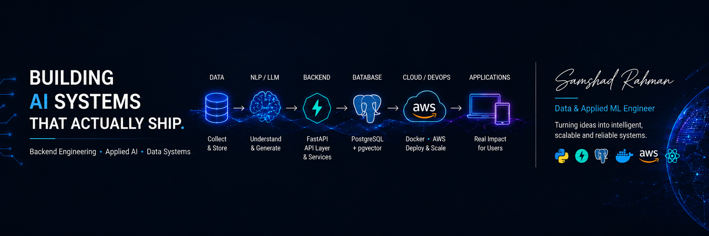

  

I build Python systems for problems that start with raw data, manual workflows, or an idea that needs to become a dependable product. My work sits between backend engineering and applied AI, including APIs, data pipelines, retrieval systems, and the infrastructure around them. I focus on the parts that make a project useful in practice: clear data models, reliable services, validation, and deployment.

## Tools I Work With

**Backend & data**  
Python · FastAPI · Django · Flask · PostgreSQL · MySQL · SQLAlchemy · Redis · REST APIs · GraphQL · ETL

**Applied AI**  
LLMs · RAG · pgvector · Ollama · Llama · LoRA · PyTorch · scikit-learn · spaCy · BERTopic

**Infrastructure**  
Docker · AWS · GitHub Actions · CloudFormation · Linux · CI/CD
